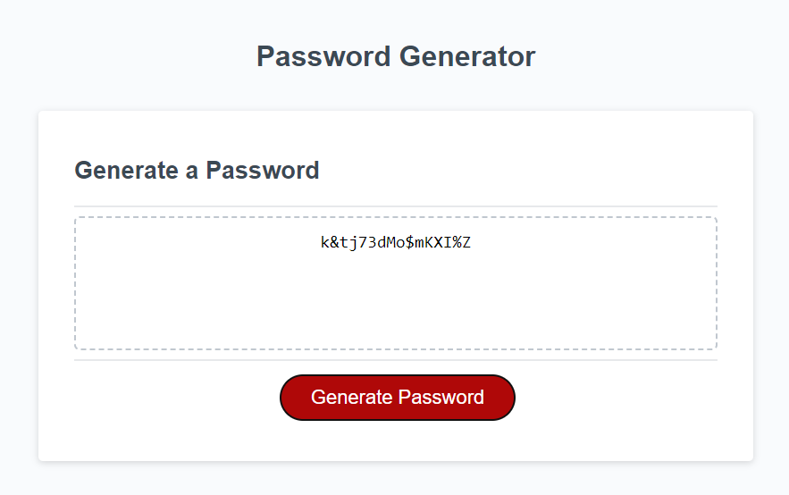

# Fullstack Development Challenge 3

## Welcome to the third challenge for the UCLA edX full stack development bootcamp! 

In this challenge we were supposed to rework a starter Javascript code so that it would generate a random password. For this to work, we needed to be able to ask what criteria it would need, and from there make a new password only using the criteria selected. Lets start with our user story and acceptance criteria:

## User Story

```
AS AN employee with access to sensitive data
I WANT to randomly generate a password that meets certain criteria
SO THAT I can create a strong password that provides greater security
```

## Acceptance Criteria

```
GIVEN I need a new, secure password
WHEN I click the button to generate a password
THEN I am presented with a series of prompts for password criteria
WHEN prompted for password criteria
THEN I select which criteria to include in the password
WHEN prompted for the length of the password
THEN I choose a length of at least 8 characters and no more than 128 characters
WHEN asked for character types to include in the password
THEN I confirm whether or not to include lowercase, uppercase, numeric, and/or special characters
WHEN I answer each prompt
THEN my input should be validated and at least one character type should be selected
WHEN all prompts are answered
THEN a password is generated that matches the selected criteria
WHEN the password is generated
THEN the password is either displayed in an alert or written to the page
```

## The Completed Challenge
As you can see below, we now have a completed password generator with the following criteria now completed, which you can see below:



To visit this site and try out all the different combinations, you may click [here](https://falafelrapper.github.io/js-password-generator/)! Feel free to try different combinations of passwords to generate!

## Credits
This refactor was completed by Zachary Roy with help from Bryan Swarthout via Office Hours and tutoring from Andrew Tirpok.